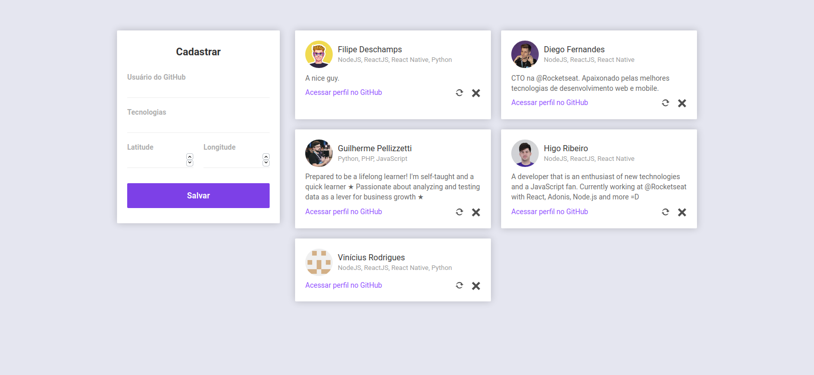
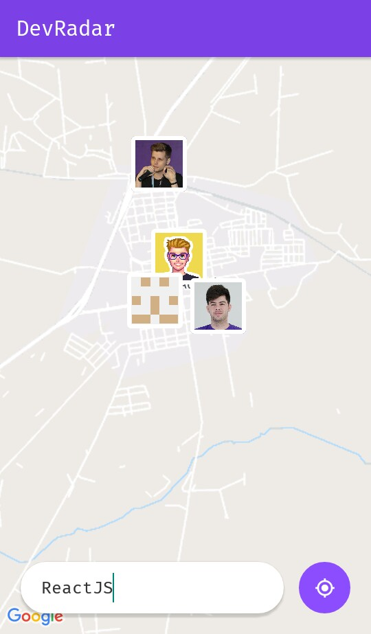

<h1 align="center">:earth_americas: DevRadar</h1>

<h2 align="center">
	Projeto desenvolvido na 10.º edição da Semana Omnistack que visa conectar desenvolvedores próximos a sua região.
</h2>

 

<h3 align="center">
	Interface web:
	 
	
</h3>

 

<h3 align="center">
	Interface mobile:
	 
	
</h3>

 

## :computer: Tecnologias usadas

* NodeJS
* ReactJS
* React Native
* Expo
